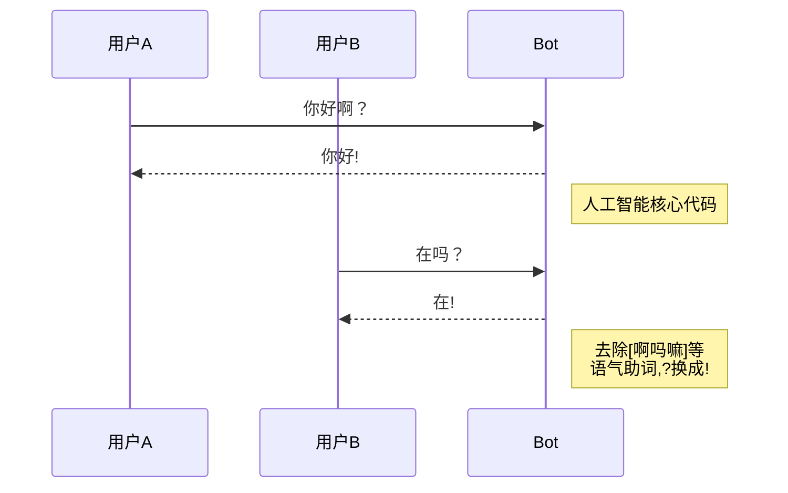

# meeko

[](https://coveralls.io/github/kongnet/meeko?branch=master)
[](https://www.codacy.com/app/9601698/meeko?utm_source=github.com&amp;utm_medium=referral&amp;utm_content=kongnet/meeko&amp;utm_campaign=Badge_Grade)

[](https://nodei.co/npm/meeko/)

[](https://github.com/kongnet/meeko)

## 开始你的征途 Start your way
``` js
let $ = require('meeko')
```

## 数学函数 Math function
* *intersect (a = [])* 交集
``` js
[1,2,3].intersect([3,4,5]) => [3]
```
* *union (a = [])* 并集
``` js
[1,2,3].union([3,4,5]) => [1,2,3,4,5]
```
* *except (a = [])* AB差集 属于A不属于B BA差集 反之
``` js
[1, 2, 3, 4].except([2, 3, 5]) => [1,4]
[2, 3, 5].except([1, 2, 3, 4]) => [5]
```
* *$.math.linearFitting (x = [],y = [])* --------线性拟合 y=a*x+b
* *$.math.exponentFitting (x = [],y = [])* ---指数拟合 y=a*e^(b*x)
* *$.math.lnFitting (x = [],y = [])* -------------对数拟合 y=a*ln(x)+b
* *$.math.powerFitting (x = [],y = [])* -------幂函数拟合 y=a*x^b
* *$.math.pearson (x = [],y = [])* -------------皮尔森相似度

## JSON color format
``` js
* $.dir(object)
* 内部10行代码实现 注意字符串下标数组无法显示
```


## 颜色基本函数 Color basic function
``` js
$.log($.c.dimr('dimred', backGroundColor[41-47], isUnderline))
```
## 日期格式化 Date format
``` js
yyyy/YYYY mm/MM ww/WW dd/DD hh/HH mm ss SS(毫秒) q(季度) X(unix秒)
$.now().format('X')
```
## 基础数据类型判断函数 Data type check
* *isObj===isObject* 只接受对象型
* *isStringt* 只接字符型
``` js
其他对象会强制转化为String
注意,不要设置默认值,不是字符串,有长度len判断时会有风险
```
* *isBoolean* 只接受布尔型
* *isBool* 泛布尔型
``` js
[0, 1, true, false, '0', '1', 'true', 'false']都可以
```
* *isNumber* 只接受浮点型，也不接受{},[]等内部转换
* *isBigInt* 只接受bigInt型
* *isArray* 只接受数组t型
* *isNull* 只接受null型
* *isUndefined* 只接受undefined型
* *isRegExp* 只接受正则型

* *isDecimal* 泛浮点型
``` js
[null, undefined, 正则, 布尔值, {}, []]不可以
可以化为数值的字符串 可以, 但类似 '1x' 不可以
```
* *isInt 整型 isPInt 正整型 isNInt负整型*
``` js
同isDecimal 原则
```
* *isDate*
``` js
可以化为日期的字符串，日期型都可以。日期型没意义因为初始化就确定时间了,日期字
符型必须有 “/” 或者 “-”
#now() 作为默认值代表 当前时间 
```
## checkParam
``` js
增加 enum类型，def不起作用 size设置不能为空,且为数组
```

## 原型扩展 Array prototype
* *remove (idx = 0, len = 1)*
``` js
[1, 2, 3, 4, 5].remove(1,2) => [1,4,5]
```
* *count()* 
``` js
 ['A', 'B', 'B', 'C', 'A', 'D'].count() => {"A":2,"B":2,"C":1,"D":1}
```
* *flatten()* 
``` js
[1, [2, [3, [4, 5], 6], 7], 8].flatten() => [1,2,3,4,5,6,7,8]
```
* *orderBy()* 
``` js
[{ name: 'A', age: 48 }, { name: 'B', age: 36 }, { name: 'C', age: 26 }]
.orderBy(['age'],['asc']) 
=> [{"name":"C","age":26},{"name":"B","age":36},{"name":"A","age":48}] 默认升序
```
## 原型扩展 String prototype
* *upperFirst()* ----------------将首字母变成大写,其他小写
* *String.render(o)* ----------字符串模板渲染
* *fillStr(str, len, pos = 1)* --填入什么字符多少位,中文算2个字符,pos 1右面填，-1左面填

### Notice
``` js
$.tools.checkParam(obj)
* obj 如果为日期格式,日期格式为UTC日期
* 请在前端写入mysql之前 date.date2Str()一下
* 否则需要主动调用mysql的转换utc时间的函数
```
## 正则发生器 RegExp generator
``` js
r = '(你|我|他)'
console.log($.reg.gen(r))
```
## 路径下所有js文件全加载
``` js
$.requireAll() // 加载某个目录下的所有对象，默认 __dirname
```
## 分布式雪花碎片算法 每秒可以产生超过200万 不重复id
``` js
new $.Snowflake(workId, dataCenterId, sequence) // 工作进程id ，服务器id，开始序号
```
## 一个函数的输出是另一个函数的输入 pipe
``` js
 let r = $.pipe(x => x.toUpperCase(), ------单词变大写
      a => a.split(''), --------------------分成数组
      a => a[3], ---------------------------取下标3
      s => s.charCodeAt(0).toString(16), ---变为16进制
      s => s.fillStr('0', 4, -1), ----------不足4位部分左边填0
      s => `\\u${s}` -----------------------转成\uxxxx 形式
    )('Test') ------------------------------ => \u0054
```

